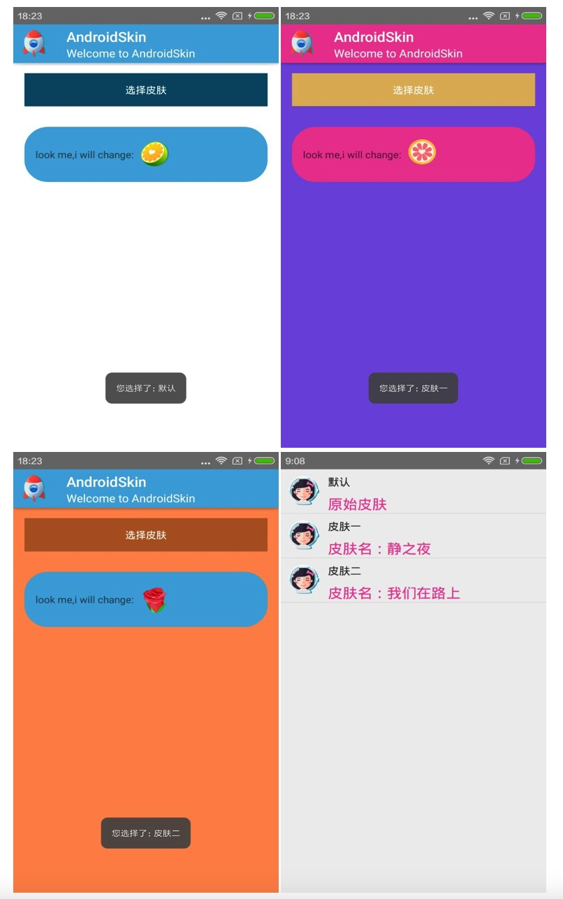

# Android-Skin


## 介绍

Android-Skin：极简单的android换肤框架，无缝支持第三方控件，一行代码即可换肤，集成成本极低，
提供丰富的API支持拓展.


```java
AndroidSkin.getInstance().saveSkinAndApply(skinFilePath, SkinLoader.ASSETS);
```

执行之后，app即完成换肤，你将看到华丽的换肤效果；


## Demo




## Usage

### 1、在 app/buil.gradle 添加

```java
compile 'com.meiyou:android-skin:1.0'
```

### 2、初始化

在application oncreate 加入初始化代码

```java
AndroidSkin.getInstance().init(this);
```

### 3、加载/恢复皮肤

加载皮肤

```java
AndroidSkin.getInstance().saveSkinAndApply(apkFile, SkinLoader.ASSETS,null);
```	
	
	
恢复默认皮肤

```java
AndroidSkin.getInstance().clearSkinAndApply();
```	
	
	
## Know More

### 1、换肤控制粒度；

默认全app换肤，关闭换肤级别有：

####  关闭 activity 换肤

```java
在onCreate加入
AndroidSkin.getInstance().registerIgnoreSkinActivity(this)
在onDestory加入
AndroidSkin.getInstance().unRegisterIgnoreSkinActivity(this)
```	


####  关闭 view 换肤

```java
AndroidSkin.getInstance().registerIgnoreSkinView(view)
```	


####  关闭 view 的某个属性换肤

```java
AndroidSkin.getInstance().registerIgnoreSkinView(view,"background","textColor”)
```	


### 2、多种加载皮肤方式


```java
 //从Sd卡保存皮肤信息，不应用
 AndroidSkin.getInstance().saveSkin(apkFile);
 AndroidSkin.getInstance().saveSkin(apkFile, SkinLoader.SDCARD);
 
 //从Sd卡保存皮肤信息并立刻应用
 AndroidSkin.getInstance().saveSkinAndApply(apkFile,listener);
  
 //从assets保存皮肤信息，不应用
 AndroidSkin.getInstance().saveSkin(apkFile, SkinLoader.ASSETS);
 
  //从assets保存皮肤信息并应用
 AndroidSkin.getInstance().saveSkinAndApply(apkFile,SkinLoader.ASSETS,listener);
 
 //从sd卡保存皮肤信息并应用
 AndroidSkin.getInstance().saveSkinAndApply(apkFile,listener);
 AndroidSkin.getInstance().saveSkinAndApply(apkFile,SkinLoader.SDCARD,listener);
```	

###	3、动态设置

由于换肤原理采用的是Hook LayoutInflater的方式，所以对于用户自己new 出来的View不具有动态换肤的效果
所以提供了一系列的API来满足这方面的需求；

#### 获取相应的换肤资源，这里主要用于需要对Color或者Drawable进行操作的需求

```java
AndroidSkin.getInstance().getSkinId();

AndroidSkin.getInstance().getSkinDrawable();

AndroidSkin.getInstance().getSkinColorDrawable()

AndroidSkin.getInstance().getSkinColorStateList();

AndroidSkin.getInstance().getSkinColor();        
```	                    

#### 手动设置换肤

```java
AndroidSkin.getInstance().setBackgroundDrawable();

AndroidSkin.getInstance().setImageDrawable();

AndroidSkin.getInstance().setTextColor();
```	  
### 4、打包皮肤包

和普通的打包apk包一样，将同名资源在对应的res文件夹下即可，具体请参考project的skinone和skintwo；
比如：

主app里TextView:android:textColor="R.color.white";其中

```java
<color name="white">#ffffff</color>
```	 
则在换肤工程里res也加上white这个对应的换肤颜色即可

```java
 <color name="white">#fffeee</color>
```	 
然后gradle clean assembleRelease生成apk，放到主app的assets下或者放到sd卡，
使用AndroidSkin加载皮肤即可生效


